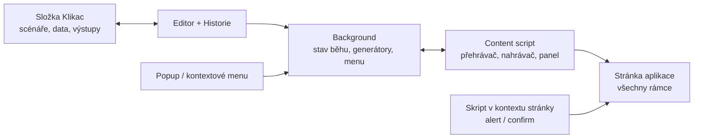

# Klikač – návrh rozšíření pro zakládání testovacích subjektů

Sep 24, 2026 · @Jakub

## Cíl a principy

Klikač je Chrome rozšíření, které podle textových scénářů zakládá testovací subjekty a vyplňuje úseky řízení (společník, adresa…) ve staré notářské aplikaci. Běží na vzdálené ploše bez admin práv; instaluje se přes *Load unpacked*.

- **Scénář je obyčejný textový soubor.** Hlavní způsob práce je psát a ladit scénáře v textovém editoru. Nahrávání jen vytvoří první verzi, kterou pak člověk upraví.
- **Jeden řádek = jeden krok.** Česká slova (`klikni`, `vypln`, `vyber`), žádné programování, komentáře přes `#`.
- **Skládání z úseků.** Opakované části (společník, adresa, uložení) existují jednou a celé založení je poskládá přes `pouzij`.
- **Data generuje rozšíření.** Jména, rodná čísla, IČO a názvy firem jsou platné a k sobě sedí; každé spuštění dá nová data.
- **Co se stane, se zapíše.** Vygenerované i přidělené hodnoty (IČO, spisová značka) jdou do výstupu CSV.
- **Rozšiřitelnost.** Jádro je malé a stabilní, generátory a seznamy slov se přidávají zvlášť.

## Struktura souborů

Scénáře, seznamy slov i výstupy jsou běžné soubory v jedné pracovní složce, kterou si v rozšíření jednou vybereš (např. `Dokumenty\Klikac`). Edituješ je v Poznámkovém bloku, VS Code nebo přímo v editoru rozšíření; změny se projeví hned bez přenačítání rozšíření.

```
Klikac/
├─ zalozeni/                 celé scénáře (začínají otevri)
│   ├─ Zaloz FO.txt
│   ├─ Zaloz sro.txt
│   └─ Zaloz spolek.txt
├─ useky/                    běží na právě otevřené stránce
│   ├─ Spolecnik.txt
│   ├─ Jednatel.txt
│   ├─ Adresa.txt
│   └─ Ulozit.txt
├─ data/                     seznamy pro generátory (volitelné, přepíšou vestavěné)
│   ├─ firmy-zaklad.txt
│   ├─ firmy-obor.txt
│   ├─ spolky.txt
│   └─ vlastni.txt           vlastní seznamy a vzory (např. spisová značka)
├─ vystupy/                  CSV s výsledky běhů, jeden soubor na měsíc
│   └─ 2026-09.csv
└─ nastaveni.txt             adresa aplikace, výchozí pauza a timeout
```

- Složka určuje typ: co je v `useky/`, se nabízí v kontextovém menu a v panelu na stránce.
- Název scénáře = název souboru bez `.txt`; podsložky jsou povolené (`useky/sro/Spolecnik.txt` → `sro/Spolecnik`).
- Přístup ke složce zajišťuje File System Access API. Po restartu prohlížeče Chrome jednou požádá o potvrzení přístupu (jedno kliknutí).
- Protože vše leží ve složce, scénáře jdou sdílet s kolegy (síťový disk, Git) a nepřijdeš o ně ani při smazání profilu Chromu.
- Záložní režim: kdyby File System Access na vzdálené ploše nešel, scénáře se drží uvnitř rozšíření s importem a exportem `.txt`.

## Formát scénáře

Každý řádek je příkaz, selektor (co na stránce) a případně hodnota za `=`. Řádky začínající `#` jsou komentáře; na začátku souboru může být `# popis: …`, který se ukáže v menu.

### Příkazy

| Příkaz | Co dělá |
| --- | --- |
| `otevri URL` | otevře adresu (první řádek celého založení) |
| `klikni SEL` | klikne na tlačítko, odkaz, záložku |
| `vypln SEL = hodnota` | vyplní pole a vyvolá focus/input/change/blur, aby proběhly validace aplikace |
| `pis SEL = hodnota` | píše po znacích (pole s maskou nebo `onkeyup`) |
| `vyber SEL = text` | vybere položku v rozbalovacím seznamu |
| `zaskrtni SEL` / `odskrtni SEL` | checkbox |
| `cekej 1000` | pevná pauza v ms |
| `cekej-na SEL` | počká, až se prvek nebo text objeví |
| `zmiz SEL` | počká, až prvek zmizí („Načítám…“) |
| `pouzij Název` / `pouzij Název 2x` | vloží jiný scénář, případně opakovaně |
| `nastav x = hodnota` | vlastní proměnná, pak `{x}` |
| `nova osoba` / `nova firma` | vygeneruje novou sadu dat uprostřed scénáře |
| `zapamatuj x = SEL` | uloží hodnotu ze stránky do výstupu |
| `pauza 300` | výchozí pauza mezi kroky od tohoto řádku |
| `timeout 10000` | jak dlouho max. čekat na prvek |
| `dialogy ano` / `ne` | odpověď na `confirm()`; `alert()` se odklikne vždy |
| `stop` | zastaví a přepne do krokování (ladicí bod) |
| rucne Pokyn pro uživatele | pozastaví běh a čeká na ruční zásah; pokračuje se tlačítkem Pokračovat v panelu |

### Selektory

| Zápis | Význam |
| --- | --- |
| `#txtJmeno`, `[name="prijmeni"]` | CSS selektor |
| `text:"Uložit"` | tlačítko nebo odkaz s tímto textem; u `cekej-na` jakýkoli text |
| `label:"Příjmení"` | pole u popisku (`<label>` nebo vedlejší buňka tabulky) |
| `xpath://td[2]/input` | XPath pro obtížné případy |
| `@main #txtJmeno` | hledá jen v rámci `main` (framesety), vnořené `@a/b` |

### Příklad: celé založení s.r.o.

```
# popis: Založí s.r.o. se dvěma společníky
otevri    https://notar.local/Subjekty/Novy.aspx
vyber     @main #ddlTyp = "Právnická osoba"
vypln     @main #txtNazev = {firma.nazev} s.r.o.
vypln     @main #txtICO = {firma.ico}
pouzij    Adresa
pouzij    Spolecnik 2x
pouzij    Ulozit
zapamatuj spz = @main #lblSpisovaZnacka
```

### Příklad: úsek Společník

```
# popis: Přidá společníka do otevřeného řízení
klikni    @main text:"Přidat společníka"
cekej-na  @main #txtSpolJmeno
vypln     @main #txtSpolJmeno = {osoba.jmeno}
vypln     @main #txtSpolPrijmeni = {osoba.prijmeni}
vypln     @main #txtSpolRC = {osoba.rc}
vypln     @main #txtSpolVklad = {cislo:10000-200000}
klikni    @main text:"Potvrdit"
cekej-na  @main text:"Společník přidán"
```

Když scénář selže, panel ukáže soubor a číslo řádku (`useky/Spolecnik.txt:5`) a zvýrazní prvek, na kterém to spadlo.

## Generátory dat

Hodnoty se do scénáře dosazují jako `{entita.vlastnost}`. Data jedné entity k sobě sedí: jméno odpovídá pohlaví, rodné číslo datu narození, PSČ městu.

| Entita | Proměnné |
| --- | --- |
| osoba | `pohlavi` (M/Z), `jmeno`, `prijmeni` (Novák / Nováková), `cele_jmeno`, `datum_nar`, `rc`, `rc_lomitko` (platné, dělitelné 11) |
| firma | `nazev` (bez formy), `forma`, `nazev_s_formou`, `nazev_unik`, `ico` (správná kontrolní číslice), `dic` |
| spolek | `nazev` (např. „přátel historie Kladna“) |
| adresa | `ulice`, `cp`, `co`, `mesto`, `psc` |
| obecné | `{dnes}`, `{rok}`, `{uid}`, `{email}`, `{telefon}`, `{nahodne:6}`, `{pismena:4}`, `{cislo:1-100}`, `{vyber:a\|b\|c}` |

### Názvy firem a právní forma

Generátor dává jen jádro názvu a formu doplní scénář obyčejným textem kolem proměnné. Přípona i předpona jsou tak vidět přímo v souboru a jdou snadno změnit:

```
vypln #txtNazev = {firma.nazev} s.r.o.         → Delta Stavby s.r.o.
vypln #txtNazev = {firma.nazev} a.s.           → Horizont Invest a.s.
vypln #txtNazev = {firma.nazev}, v.o.s.        → Horák a Beneš, v.o.s.
vypln #txtNazev = Spolek {spolek.nazev}         → Spolek přátel historie Kladna
vypln #txtNazev = Nadace {firma.nazev}          → Nadace Rubín
vypln #txtNazev = {firma.nazev_s_formou}        → náhodná forma
vypln #txtNazev = TEST {firma.nazev_unik} s.r.o. → TEST Atlas Logistik 7K2 s.r.o.
```

- `nazev_unik` přidá krátký kód pro případ, že aplikace odmítá duplicitní názvy.
- Styly názvu: `{firma.nazev}` (Delta Stavby), `{firma.nazev:prijmeni}` (Horák a Beneš), `{firma.nazev:kratky}` (Rubín).
- Slova se berou ze souborů `data/firmy-zaklad.txt`, `data/firmy-obor.txt` a `data/spolky.txt`, jedno slovo nebo vzor na řádek. Když soubor chybí, použije se vestavěný seznam.

### Platnost dat

- `osoba` a `adresa` jsou lokální pro soubor: každé `pouzij Spolecnik` = nový člověk.
- `firma` je společná pro celé spuštění, takže úsek uvnitř založení vidí název a IČO zakládané firmy.
- Pojmenované instance pro víc osob v jednom souboru: `{osoba:zmocnenec.jmeno}`.
- `nova osoba` nebo `nova firma` vygeneruje novou sadu ručně.

### Rozšiřování generátorů

- **Bez programování** v `data/vlastni.txt`, počítají se hned:

  ```
  seznam titul = Ing.|Mgr.|Bc.|JUDr.|
  vzor   spisova_znacka = NZ {cislo:100-999}/{rok}
  ```
- **Jako plugin** (algoritmus, např. číslo OP s kontrolní číslicí): soubor ve složce `generatory/` uvnitř rozšíření, který se zaregistruje jednou funkcí. Potřebuje znovunačtení rozšíření, protože Manifest V3 nedovolí spouštět kód zapsaný v editoru.

## Sběr hodnot a výstup

Každý běh zapíše řádek do `vystupy/RRRR-MM.csv`: čas, scénář, výsledek a všechny posbírané hodnoty. CSV má středníky a UTF-8 s BOM, takže se v Excelu otevře rovnou s češtinou.

- **Automaticky** se sbírá vše vygenerované: firma (název, IČO) a každá osoba s číslem podle pořadí (`spolecnik1_rc`, `spolecnik2_rc`…, název podle úseku).
- **Ze stránky** přes `zapamatuj`, typicky co přidělí aplikace:

  ```
  zapamatuj spz  = #lblSpisovaZnacka
  zapamatuj id   = text:"Subjekt uložen pod č." /(\d+)/
  zapamatuj stav = #ddlStav
  ```

  Nepovinný regulární výraz na konci vytáhne jen potřebnou část textu.
- **Poznámka:** `zapamatuj poznamka = Test přepisu vlastníka` zapíše pevný text pro orientaci ve výstupu.

```csv
čas;scénář;výsledek;spz;ico;nazev_firmy;spolecnik1;spolecnik1_rc;spolecnik2;spolecnik2_rc
24.09.2026 14:03;Zaloz sro;OK;NZ 412/2026;27074358;Delta Stavby s.r.o.;Jan Novák;900312/1234;Eva Černá;855105/4321
24.09.2026 14:07;useky/Spolecnik;chyba ř. 5;;;;Petr Horák;780921/5541;;
```

- **Hned po běhu** ukáže panel posbírané hodnoty s tlačítkem Kopírovat u každé.
- **Historie** v rozšíření je tabulka běhů s filtrem podle scénáře a data.
- **Navazování:** `{posledni.spz}` nebo `{posledni.ico}` vloží hodnotu z posledního úspěšného běhu, např. úsek „Vyhledej řízení“ si vezme spisovou značku z předchozího založení.

## Ovládání a ladění

Celá založení se spouštějí z popupu, úseky přímo ze stránky bez otevírání popupu.

| Kde | Co tam je |
| --- | --- |
| Popup (ikona rozšíření) | výběr scénáře, počet opakování, Spustit, Krok po kroku, Nahrávat, Editor, Historie |
| Kontextové menu (pravé tlačítko) | Klikač → seznam úseků s popisem, např. „Společník – přidá společníka“ |
| Plovoucí panel na stránce | oblíbené úseky jako tlačítka, pole „kolikrát“, průběh běhu, Stop, výsledek s hodnotami; jde sbalit |
| Klávesová zkratka | zopakuje naposledy spuštěný úsek |
| Editor (stránka rozšíření) | strom scénářů ze složky, textové pole se zvýrazněním, kontrola chyb s číslem řádku, nápověda, náhled vygenerovaných dat |

### Ladění scénáře

- **Krok po kroku:** panel ukáže další řádek a zvýrazní cílový prvek; tlačítka Další, Pokračovat, Stop.
- **`stop` ve scénáři** funguje jako ladicí bod: běh došel sem a dál se krokuje.
- **Spustit od řádku:** v editoru kurzor na řádek → „Spustit odsud“ na aktuální stránce. Hodí se, když se opraví konec dlouhého scénáře.
- **Chyba** zastaví běh, ukáže soubor, řádek a důvod („prvek nenalezen do 10 s“, „položka v seznamu neexistuje“) a nabídne Zkusit znovu, Přeskočit a Stop.
- **Zkouška selektoru:** v editoru se dvojklikem na selektor zvýrazní nalezený prvek na stránce, nebo se hlásí, že nic nenašel.

### Ruční zásah uprostřed scénáře

Příkaz `rucne` běh pozastaví. Mezitím můžeš na stránce dělat cokoli, třeba ručně zadat konkrétní společníky, a pak v panelu dáš Pokračovat.

```
# popis: Založí s.r.o., společníky zadá uživatel ručně
otevri    https://notar.local/Subjekty/Novy.aspx
vyber     @main #ddlTyp = "Právnická osoba"
vypln     @main #txtNazev = {firma.nazev} s.r.o.
vypln     @main #txtICO = {firma.ico}
pouzij    Adresa
rucne     Zadej společníky a dej Pokračovat
pouzij    Ulozit
zapamatuj spz = @main #lblSpisovaZnacka
```

- **Panel** během pauzy ukazuje pokyn a tlačítka Pokračovat a Stop. Stav přežije i postbacky, které při ruční práci vyvoláš.
- **Pomocné úseky** můžeš během pauzy spouštět z panelu nebo kontextového menu, třeba jednou ručně zadaný společník a dva vygenerované. Po skončení úseku se hlavní scénář vrátí do pauzy.
- **Automatické pokračování** (volitelně): `rucne Zadej společníky dokud text:"Společníci: 2"` pokračuje sám, jakmile se text objeví.
- **Hodnoty z ručního zadání** jdou po pauze uložit do výstupu přes `zapamatuj`, např. seznam společníků z tabulky na stránce.

### Nahrávání (pomůcka)

1. V popupu Nahrávat. Pro celé založení začni na úvodní stránce, pro úsek až na místě v řízení.
2. Projdi postup ručně. Panel ukazuje počet kroků a má tlačítka „+ čekání“ a „+ čekat na text“.
3. Ukončit → zeptat se na název a složku (`zalozeni/` nebo `useky/`) → uložit a otevřít v editoru.
4. Editor nabídne náhrady: hodnota vypadající jako RČ → `{osoba.rc}`, IČO → `{firma.ico}`, datum → `{osoba.datum_nar}`. Každou náhradu potvrdíš zvlášť.

Nahrávač volí selektory v pořadí id → name → text tlačítka → CSS cesta, zapisuje rámec (`@main`) a opakované změny jednoho pole sloučí do jednoho řádku. Kliknutí do textových polí a na prázdná místa nezapisuje.

## Architektura rozšíření

Rozšíření má pět částí. Stav běhu drží background, takže běh přežije postback i znovunačtení stránky.



| Modul | Odpovědnost |
| --- | --- |
| `background.js` | stav běhu, rozbalení `pouzij`, dosazení proměnných, kontextové menu, zápis výstupu |
| `content.js` (všechny rámce) | v horním rámci přehrávač a panel, v každém rámci nahrávač |
| `page-dialogs.js` (kontext stránky) | přebije `alert`/`confirm`, aby dialog nezablokoval běh |
| `lib/dsl.js` | parser scénářů, sdílený editorem i přehrávačem |
| `generatory/*.js` | pluginy generátorů (osoba, firma, spolek, adresa, obecné) |
| `popup.html`, `editor.html`, `historie.html` | uživatelské rozhraní |

### Spolehlivost na staré aplikaci

- **Žádný krok dvakrát:** číslo kroku se uloží před akcí. Když akce vyvolá postback, nová stránka pokračuje dalším krokem.
- **Automatické čekání:** každý krok čeká, až je prvek vidět a je aktivní. Pevné `cekej` se použije jen výjimečně.
- **Hlídání znovunačtení rámce:** po kliknutí se čeká, jestli se rámec nezačal načítat. Další krok tak nesahá do staré verze stránky.
- **Rámce:** přehrávač v horním rámci sahá do same-origin rámců přímo. U framesetů, kde horní dokument nemá `body`, se panel zobrazí v největším rámci.
- **Události:** vyplnění vyvolá focus, input, change a blur; `vyber` vyvolá change, takže funguje i AutoPostBack.
- **Dialogy:** `alert` se zaloguje a odklikne, na `confirm` se odpoví podle `dialogy ano/ne`. Text dialogu jde do výstupu.

## Omezení, rizika a postup vývoje

Největší riziko je firemní politika Chromu na vzdálené ploše. Ověřit je potřeba dřív, než začne vývoj.

| Riziko | Dopad | Řešení |
| --- | --- | --- |
| Politika zakazuje Developer mode nebo rozšíření | nejde nainstalovat | ověřit na `chrome://policy`; zálohou je userscript (Tampermonkey) nebo bookmarklet s užšími možnostmi |
| File System Access nefunguje | scénáře nejsou ve složce | scénáře uvnitř rozšíření + import a export `.txt` |
| Rámce z jiné domény | přehrávač do nich nedosáhne | u starých aplikací nepravděpodobné; řešení je přehrávání přímo v rámci |
| Prvky bez stabilních id | křehké selektory | `label:` a `text:` selektory, ruční doladění v editoru |
| Smazání profilu Chromu po odhlášení | ztráta nastavení | scénáře i výstupy jsou ve složce, v profilu jen výběr složky |

### Fáze

1. **Přehrávač:** formát scénáře, všechny příkazy včetně `rucne`, rámce, dialogy, popup, scénáře ze složky.
2. **Generátory a výstup:** osoba, firma, spolek, adresa, `data/*.txt`, `zapamatuj`, CSV a historie.
3. **Úseky a ovládání:** kontextové menu, plovoucí panel, klávesová zkratka, krokování, „Spustit odsud“.
4. **Nahrávač:** záznam kroků, návrhy náhrad proměnnými.
5. **Doladění na vaší aplikaci** podle uloženého HTML obrazovek a prvních skutečných scénářů.

### Před startem potřebuji

- [ ] Výstup `chrome://policy` ze vzdálené plochy (stačí snímek obrazovky)
- [ ] Uložené HTML obrazovek založení subjektu a přidání společníka (Ctrl+S), klidně bez osobních údajů
- [ ] Seznam typů subjektů a úseků, které chcete jako první
